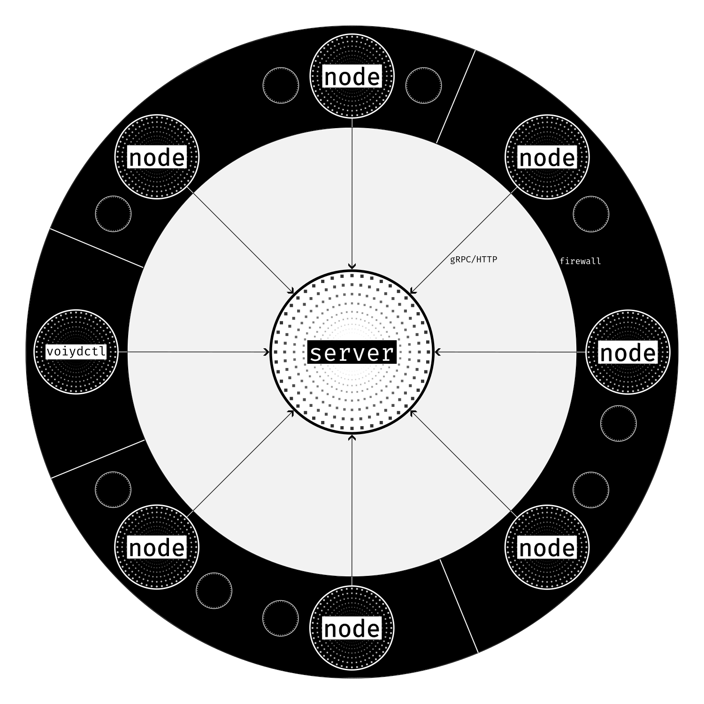

  

  Lightweight, event‑driven orchestration for container workloads
   
  <a href="https://voiyd.io">voiyd.io</a>

---

Voiyd is a lightweight container orchestration platform for managing workloads centrally across Linux infrastructure. It helps you run and manage containers with a simple CLI and declarative configuration.

The project grew out of a practical problem in my own homelab. I have many Linux hosts with very different hardware profiles, most of them cheap low-resource ARM devices, spread across locations, often behind NAT and firewalls, and sometimes connected over higher-latency links. I wanted something centrally managed, easy to understand, and straightforward to operate on my own terms.

> **Note**: This project is under active early development and unstable. Features, APIs, and behavior are subject to change at any time and may not be backwards compatible between versions. Expect breaking changes.

<!--toc:start-->
- [Why voiyd exists](#why-voiyd-exists)
- [Features](#features)
- [Architecture](#architecture)
- [Components](#components)
- [Getting Started](#getting-started)
- [License](#license)
- [Contributing](#contributing)
<!--toc:end-->

## Why voiyd exists

voiyd started as a way to solve orchestration for my own infrastructure. I have many Linux servers with very different hardware configuration, and most of them are cheap ARM devices with limited resources. They are spread across different locations, often behind NAT and firewalls where opening inbound access is not an option, and the links between them have fairly high latency. I wanted a way to manage everything centrally, keep the workflow simple through a CLI, and still define infrastructure declaratively. voiyd exists to support that kind of environment. Centrally managed orchestration that stays lightweight, understandable, and practical.

## Features

- **Central control plane**: voiyd-server provides the API and manages cluster state.
- **Node agent**: voiyd-node runs on each worker node and integrates with a *Runtime* such as [containerd](https://containerd.io). More runtimes are beeing added for example the *Exec* runtime for legacy applications.
- **Task orchestration**: Deploy workload with *Tasks* - the unit of scheduling.
- **Declarative configuration**: Define cluster resources as yaml or json and apply them all at once from a single source of truth.
- **High-Latency Tolerance**: Designed for stretched clusters across vast distances, making it ideal for edge and IoT deployments.
- **Volume management**: Create volumes and attach them to tasks. Host-local mounts for data, templates for application configuration.
- **Networking**: Expose services with built-in [CNI](https://www.cni.dev) support.
- **Scheduling**: Built-in reactive scheduler for placing *Tasks* on nodes.
- **Event and log streaming**: Task log streaming is relayed through the server.
- **Node management and upgrades**: Perform node upgrades remotely with a single command.
- **Pluggable storage backends**: BadgerDB-based repository implementation by default.
- **CLI-focused**: Use voiydctl to manage clusters.
- **Instrumentation**: Metrics and tracing hooks in pkg/instrumentation.

## Architecture

## Components

- `voiyd-server`  
  - Exposes gRPC/HTTP APIs for cluster management
  - Stores cluster state using pluggable storage backends (BadgerDB, in-memory)
  - Handles task scheduling and placement decisions
  - Manages cluster events and log streaming
- `voiyd-node`  
  - Runs on each node.
  - Subscribes to events and executes tasks
  - Establishes an outbound connection to the server and subscribes to events.  
  - Manages tasks using a runtime and reports status and metrics back to the server.  
  - Can operate behind NAT/firewalls as long as it can reach the server.
- `voiydctl`  
  - Communicates only with the server
  - Supports multiple clusters
  - Provides intuitive commands for managing tasks, nodes, and volumes
  - Streams logs and events in real-time

## Getting Started

See the [Quick Start Guide](/docs/quick-start.md) to set up your first cluster and run your first workload. See the full [Documentation](/docs/README.md) for installation and usage details.

## License

voiyd is licensed under the Apache License, Version 2.0.
See the [`LICENSE`](./LICENSE) file for details.

## Contributing

See the [Contribution Guide](/CONTRIBUTING.md)
